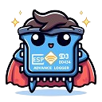

# AdvancedLogger

[](https://github.com/jibrilsharafi/AdvancedLogger/releases/latest)
[](https://registry.platformio.org/libraries/jijio/AdvancedLogger)
[](https://www.ardu-badge.com/AdvancedLogger)

[](https://www.espressif.com/en/products/socs/esp32-S3)

[](https://github.com/jibrilsharafi/AdvancedLogger/blob/master/LICENSE)

[](https://buymeacoffee.com/jibrilsharafi)

A **simple** logging library capable of **saving logs to memory** and with a **comprehensive format** capable of including all the accessory information to each message.

## Installing

The library is available on the [PlatformIO registry](https://registry.platformio.org/libraries/jijio/AdvancedLogger), and can be installed by adding the following line to the `platformio.ini` file:

```ini
lib_deps = jijio/AdvancedLogger
```

Moreover, the library is also available on the [Arduino Library Manager](https://www.arduinolibraries.info/libraries/advanced-logger), and can be installed by searching for `AdvancedLogger` in the Library Manager.

Alternatively, the library can be installed manually by downloading the latest release from the [releases page](https://github.com/jibrilsharafi/AdvancedLogger/releases).

**No external dependencies are required**, as the library uses only the standard libraries in the Arduino Framework.

The library so far has been successfully tested on the following microcontrollers:

- ESP32S3

## Usage

### Basic

The simplest way to use the library is the following:

```cpp
#include <AdvancedLogger.h>

AdvancedLogger logger;

void setup() {
    ...
    logger.begin();
    ...
}

void loop() {
    ...
    logger.info("This is an info message!", "main::setup");
    delay(1000);
    logger.error("This is an error message!! Random value: %d", "main::loop", random(0, 100));
    ...
}
```

Output (both in the Serial and in the log file in the SPIFFS memory):

```cpp
[2024-03-23 09:44:10] [1 450 ms] [INFO   ] [Core 1] [main::setup] This is an info message!
[2024-03-23 09:44:11] [2 459 ms] [ERROR  ] [Core 1] [main::loop] This is an error message!! Random value: 42
```

### Advanced

The library provides the following public methods:

- `begin()`: initializes the logger, creating the log file and loading the configuration.
- Logging methods. All of them have the same structure, where the first argument is the message to be logged, and the second argument is the function name. The message can be formatted using the `printf` syntax.
  - `verbose(const char *format, const char *function = "functionName", ...)`
  - `debug(const char *format, const char *function = "functionName", ...)`
  - `info(const char *format, const char *function = "functionName", ...)`
  - `warning(const char *format, const char *function = "functionName", ...)`
  - `error(const char *format, const char *function = "functionName", ...)`
  - `fatal(const char *format, const char *function = "functionName", ...)`
- `setPrintLevel(LogLevel logLevel)` and `setSaveLevel(LogLevel logLevel)`: set the log level for printing and saving respectively. The log level can be one of the following (The default log level is **INFO**, and the default save level is WARNING):
  - `LogLevel::VERBOSE`
  - `LogLevel::DEBUG`
  - `LogLevel::INFO`
  - `LogLevel::WARNING`
  - `LogLevel::ERROR`
  - `LogLevel::FATAL`
- `getPrintLevel()` and `getSaveLevel()`: get the log level for printing and saving respectively, as a LogLevel enum. To be used in conjunction with the `logLevelToString` method.
- `logLevelToString(LogLevel logLevel, bool trim = true)`: convert a log level from the LogLevel enum to a String.
- `setMaxLogLines(int maxLogLines)`: set the maximum number of log lines. The default value is 1000.
- `getLogLines()`: get the number of log lines.
- `clearLogKeepLatestXPercent(int percentage)`: clear the log, keeping the latest X percent of the logs. By default, it keeps the latest 10% of the logs.
- `clearLog()`: clear the log.
- `dump(Stream& stream)`: dump the log to a stream, such as the Serial or an opened file.
- `setDefaultConfig()`: set the default configuration.

For a detailed example, see the [basicUsage](examples/basicUsage/basicUsage.ino) and [basicServer](examples/basicServer/basicServer.ino) in the examples folder.

## Contributing

Contributions are what make the open source community such an amazing place to learn, inspire, and create. Any contributions you make are **greatly appreciated**. If you'd like to contribute, please fork the repository and use a feature branch. Pull requests are warmly welcome.

For more information regarding the necessity of this library, see the [WHY.md](WHY.md) file.

### What's next?

- [x] **Automatic log clearing**: if the free memory is less than a certain threshold, the oldest logs should be deleted, keeping the memory usage under control.
- [ ] **Log to SD card**: the ability to log to an external SD card would be a great addition, as it would allow to store a much larger amount of logs.
- [x] **Remove ArduinoJson dependency**: the library is used only for the configuration file, and as such it could be removed by implementing a simpler configuration in .txt format.
- [ ] **Upgrade to LittleFS**: the SPIFFS library is deprecated, and as such it should be replaced with the LittleFS library. Some effort has been made in this direction, but the nested folder approach gave some problems.
- [ ] **Test other microcontrollers**: the library is currently tested only on the ESP32, but it should be tested on other microcontrollers to ensure compatibility. The *ESP8266* has been tested, but full compatibility has not been achieved yet.
- [ ] **MQTT integration**: the ability to send logs to an MQTT server would be a great addition, as it would allow to monitor the device remotely.
- [x] **Consistent spacing**: the spacing between the different parts of the log should be consistent, to make it easier to read.
- [ ] **Buffered logging**: the ability to buffer the logs and send them in chunks would be a great addition, as it would allow to save power and reduce the number of writes to the memory. This has been tested, but the results did not show any significant improvement in speed.
- [x] **New APIs**: the logging APIs should be updated to be more consistent with the usual logging APIs, such as log.debug(...), log.info(...), log.error(...), etc.
- [x] **Customizable paths**: allow to set a custom path when creating the AdvancedLogger object, to allow for different log files.
- [x] **Custom timestamp format**: the ability to set a custom timestamp format would be a great addition, as it would allow to adapt the logs to different needs and regions.
- [x] **Dump to any stream**: the ability to dump the logs to any stream would be a great addition, as it would allow to send the logs to different destinations, such as a file or a serial port.

## Licensing

The code in this project is licensed under MIT license. See the [LICENSE](LICENSE) file for more information.
